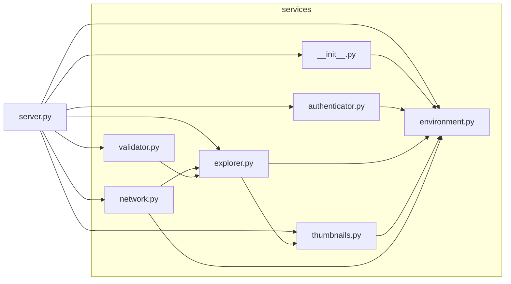

# 📁 MyFileServer v1.4.9

A lightweight file server application to transfer/stream files over network with:

- 🔷 **Frontend**: React-JS with vite and npm  
- 🔶 **Backend**: Python-Flask with uv


## How to Install on Windows (Remotely)
- Open the PowerShell terminal in Windows PC
- Copy and run the following command in the terminal
```
Start-Process powershell.exe -Verb RunAs -ArgumentList "-ExecutionPolicy Bypass -c irm https://github.com/akshay-nile/file-server-http/raw/master/scripts/remote.ps1 | iex"
```


## How to Install on Windows (Manually)
- Clone this repository in Windows PC
- Open PowerShell admin terminal inside scripts folder
- Run .\installer.ps1 script as Administrator
- Launch the MyFileServer from Desktop Shortcut
- Can be safely Uninstalled from Windows settings 


## How to Setup and Use on Android
- Make sure Pydroid-3 app is installed in Android device
- Copy and run the following command in Pydroid-3 terminal
- Open and run "Internal Storage/Documents/Pydroid 3/server.py" 
```
curl -sSL https://github.com/akshay-nile/file-server-http/raw/master/scripts/install.sh | sh
```


## Backend Architecture

