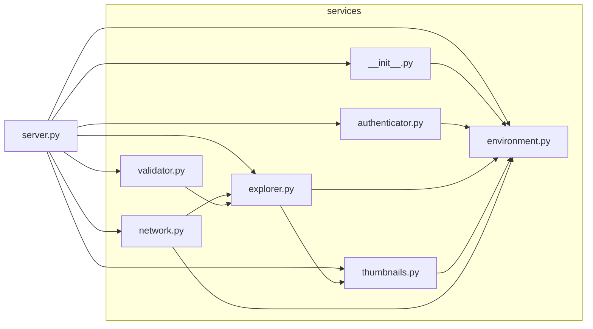
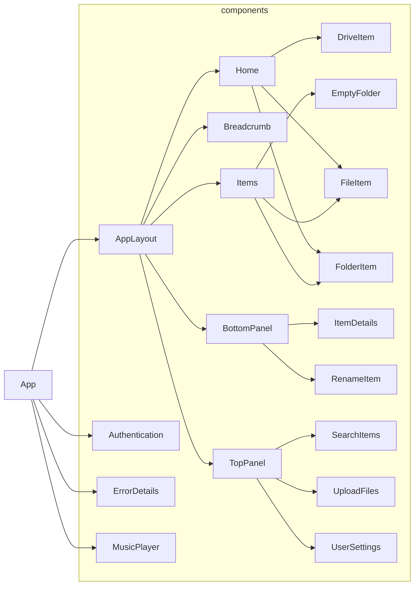

# 📁 MyFileServer v1.6.11

A lightweight file server application to transfer/stream files over network with:

- 🔷 **Frontend**:  TS-React with vite and npm  
- 🔶 **Backend**:   Python-Flask with uv


## How to Install on Windows PC
- Copy and run the following command in the PowerShell terminal
- Now you can launch the MyFileServer from its desktop shortcut
- Can be safely uninstalled from Windows (Add or Remove Programs) settings
```
Start-Process powershell.exe -Verb RunAs -ArgumentList "-ExecutionPolicy Bypass -c irm https://github.com/akshay-nile/file-server-http/raw/master/scripts/install.ps1 | iex"
```


## How to Setup and Use on Android
- Make sure Pydroid-3 app is installed in Android device
- Copy and run the following command in Pydroid-3 terminal
- Open and run "Internal Storage/Documents/Pydroid 3/MyFileServer/server.py" 
```
curl -sSL https://github.com/akshay-nile/file-server-http/raw/master/scripts/install.sh | sh
```


## Backend Architecture (Mermaid Diagram)




## Frontend Architecture (Mermaid Diagram)

